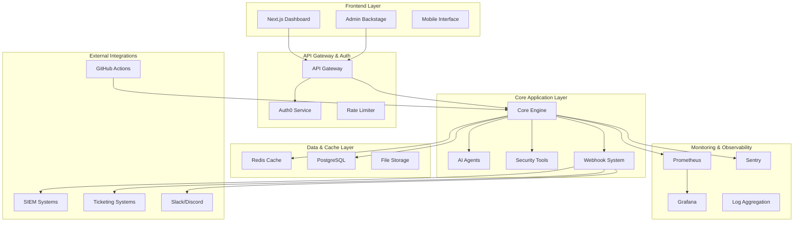

# HexStrike AI Modernization Design

## Overview

This design document outlines the transformation of HexStrike AI from a monolithic architecture to a modern, scalable, enterprise-ready platform. The modernization follows a phased approach to ensure system stability while introducing advanced features including modular architecture, authentication, monitoring, caching, and enterprise integrations.

## Architecture

### High-Level System Architecture



### Modular Architecture Design

The monolithic `hexstrike_server.py` will be refactored into the following module structure:

```
hexstrike-ai/
├── core/
│   ├── __init__.py
│   ├── app.py                 # Flask application factory
│   ├── decision_engine.py     # AI decision making
│   ├── visual_engine.py       # Output formatting
│   ├── error_handler.py       # Error management
│   ├── cache_manager.py       # Caching logic
│   └── event_system.py        # Event handling
├── agents/
│   ├── __init__.py
│   ├── base_agent.py          # Abstract base agent
│   ├── bugbounty_agent.py     # Bug bounty workflows
│   ├── ctf_agent.py           # CTF challenge solving
│   ├── vulnerability_agent.py  # Vulnerability analysis
│   ├── browser_agent.py       # Web browser automation
│   └── ai_agent.py            # Advanced AI capabilities
├── tools/
│   ├── __init__.py
│   ├── base_tool.py           # Tool interface
│   ├── network/               # Network security tools
│   │   ├── nmap_tool.py
│   │   ├── rustscan_tool.py
│   │   └── masscan_tool.py
│   ├── web/                   # Web application tools
│   │   ├── gobuster_tool.py
│   │   ├── nuclei_tool.py
│   │   └── sqlmap_tool.py
│   ├── binary/                # Binary analysis tools
│   │   ├── ghidra_tool.py
│   │   ├── radare2_tool.py
│   │   └── gdb_tool.py
│   ├── cloud/                 # Cloud security tools
│   │   ├── prowler_tool.py
│   │   ├── trivy_tool.py
│   │   └── kube_hunter_tool.py
│   └── marketplace/           # Custom tool system
│       ├── plugin_manager.py
│       ├── tool_validator.py
│       └── sandbox.py
├── api/
│   ├── __init__.py
│   ├── routes/
│   │   ├── __init__.py
│   │   ├── auth.py            # Authentication routes
│   │   ├── scans.py           # Scanning operations
│   │   ├── tools.py           # Tool management
│   │   ├── admin.py           # Admin operations
│   │   └── webhooks.py        # Webhook management
│   ├── middleware/
│   │   ├── __init__.py
│   │   ├── auth_middleware.py # JWT validation
│   │   ├── rate_limiter.py    # Rate limiting
│   │   ├── cors_handler.py    # CORS configuration
│   │   └── tenant_context.py  # Multi-tenant support
│   ├── models/
│   │   ├── __init__.py
│   │   ├── user.py            # User data models
│   │   ├── scan.py            # Scan result models
│   │   ├── tenant.py          # Tenant models
│   │   └── webhook.py         # Webhook models
│   └── serializers/
│       ├── __init__.py
│       ├── scan_serializer.py
│       └── user_serializer.py
├── config/
│   ├── __init__.py
│   ├── settings.py            # Configuration management
│   ├── database.py            # Database configuration
│   ├── redis_config.py        # Redis configuration
│   ├── auth_config.py         # Auth0 configuration
│   └── monitoring.py          # Monitoring configuration
├── services/
│   ├── __init__.py
│   ├── auth_service.py        # Authentication logic
│   ├── scan_service.py        # Scan orchestration
│   ├── notification_service.py # Webhook notifications
│   ├── tenant_service.py      # Multi-tenant management
│   └── marketplace_service.py # Tool marketplace
├── utils/
│   ├── __init__.py
│   ├── validators.py          # Input validation
│   ├── formatters.py          # Output formatting
│   ├── crypto.py              # Cryptographic utilities
│   └── helpers.py             # General utilities
├── monitoring/
│   ├── __init__.py
│   ├── metrics.py             # Prometheus metrics
│   ├── health_checks.py       # Health monitoring
│   └── alerts.py              # Alert management
├── migrations/                # Database migrations
├── tests/                     # Test suite
│   ├── unit/
│   ├── integration/
│   └── e2e/
└── hexstrike_server.py        # Main entry point
```

## Components and Interfaces

### 1. Core Engine Refactoring

**Decision Engine Interface:**
```python
from abc import ABC, abstractmethod
from typing import Dict, List, Any

class IDecisionEngine(ABC):
    @abstractmethod
    def analyze_target(self, target: str) -> TargetProfile:
        pass
    
    @abstractmethod
    def select_optimal_tools(self, profile: TargetProfile, objective: str) -> List[str]:
        pass
    
    @abstractmethod
    def optimize_parameters(self, tool: str, profile: TargetProfile, context: Dict[str, Any]) -> Dict[str, Any]:
        pass
    
    @abstractmethod
    def create_attack_chain(self, profile: TargetProfile, objective: str) -> AttackChain:
        pass
```

**Visual Engine Interface:**
```python
class IVisualEngine(ABC):
    @abstractmethod
    def format_scan_results(self, results: Dict[str, Any]) -> str:
        pass
    
    @abstractmethod
    def create_progress_bar(self, current: int, total: int, tool: str) -> str:
        pass
    
    @abstractmethod
    def format_vulnerability_card(self, vuln_data: Dict[str, Any]) -> str:
        pass
```

### 2. Authentication System (Auth0 Integration)

**Authentication Configuration:**
```python
# config/auth_config.py
import os
from authlib.integrations.flask_client import OAuth

class Auth0Config:
    DOMAIN = os.getenv('AUTH0_DOMAIN')
    CLIENT_ID = os.getenv('AUTH0_CLIENT_ID')
    CLIENT_SECRET = os.getenv('AUTH0_CLIENT_SECRET')
    AUDIENCE = os.getenv('AUTH0_AUDIENCE', 'https://hexstrike-ai.com/api')
    ALGORITHMS = ['RS256']
    
    # Role-based access control
    ROLES = {
        'admin': ['read:all', 'write:all', 'delete:all', 'manage:users'],
        'analyst': ['read:scans', 'write:scans', 'read:tools'],
        'viewer': ['read:scans', 'read:results']
    }
```

**JWT Middleware:**
```python
# api/middleware/auth_middleware.py
from functools import wraps
from flask import request, jsonify, g
import jwt
from jwt.algorithms import RSAAlgorithm
import requests

def require_auth(required_scope=None):
    def decorator(f):
        @wraps(f)
        def decorated_function(*args, **kwargs):
            token = get_token_from_header()
            if not token:
                return jsonify({'error': 'No token provided'}), 401
            
            try:
                payload = verify_jwt_token(token)
                g.current_user = payload
                
                if required_scope and not has_scope(payload, required_scope):
                    return jsonify({'error': 'Insufficient permissions'}), 403
                    
                return f(*args, **kwargs)
            except jwt.InvalidTokenError:
                return jsonify({'error': 'Invalid token'}), 401
                
        return decorated_function
    return decorator
```

### 3. Monitoring and Observability

**Prometheus Metrics:**
```python
# monitoring/metrics.py
from prometheus_client import Counter, Histogram, Gauge, generate_latest
from flask import Response

# Define metrics
scan_requests_total = Counter('hexstrike_scan_requests_total', 'Total scan requests', ['tool', 'status'])
scan_duration_seconds = Histogram('hexstrike_scan_duration_seconds', 'Scan duration', ['tool'])
active_scans = Gauge('hexstrike_active_scans', 'Number of active scans')
tool_success_rate = Gauge('hexstrike_tool_success_rate', 'Tool success rate', ['tool'])

class MetricsCollector:
    @staticmethod
    def record_scan_request(tool: str, status: str):
        scan_requests_total.labels(tool=tool, status=status).inc()
    
    @staticmethod
    def record_scan_duration(tool: str, duration: float):
        scan_duration_seconds.labels(tool=tool).observe(duration)
    
    @staticmethod
    def set_active_scans(count: int):
        active_scans.set(count)
```

**Grafana Dashboard Configuration:**
```json
{
  "dashboard": {
    "title": "HexStrike AI Monitoring",
    "panels": [
      {
        "title": "Scan Requests Rate",
        "type": "graph",
        "targets": [
          {
            "expr": "rate(hexstrike_scan_requests_total[5m])",
            "legendFormat": "{{tool}} - {{status}}"
          }
        ]
      },
      {
        "title": "Tool Success Rate",
        "type": "singlestat",
        "targets": [
          {
            "expr": "hexstrike_tool_success_rate",
            "legendFormat": "{{tool}}"
          }
        ]
      },
      {
        "title": "Active Scans",
        "type": "gauge",
        "targets": [
          {
            "expr": "hexstrike_active_scans"
          }
        ]
      }
    ]
  }
}
```

### 4. Webhook System Design

**Webhook Event System:**
```python
# core/event_system.py
from enum import Enum
from dataclasses import dataclass
from typing import Dict, Any, List, Callable
import asyncio
import aiohttp
import hmac
import hashlib
import json

class EventType(Enum):
    SCAN_STARTED = "scan.started"
    SCAN_COMPLETED = "scan.completed"
    VULNERABILITY_FOUND = "vulnerability.found"
    TOOL_FAILED = "tool.failed"
    SYSTEM_ALERT = "system.alert"

@dataclass
class WebhookEvent:
    event_type: EventType
    payload: Dict[str, Any]
    timestamp: str
    tenant_id: str = None

class WebhookManager:
    def __init__(self):
        self.subscribers: Dict[EventType, List[Callable]] = {}
        self.webhook_urls: Dict[str, Dict[str, Any]] = {}
    
    async def emit_event(self, event: WebhookEvent):
        # Notify local subscribers
        if event.event_type in self.subscribers:
            for callback in self.subscribers[event.event_type]:
                await callback(event)
        
        # Send to external webhooks
        await self._send_webhooks(event)
    
    async def _send_webhooks(self, event: WebhookEvent):
        tasks = []
        for webhook_id, config in self.webhook_urls.items():
            if self._should_send_event(event, config):
                task = self._send_webhook(config['url'], event, config.get('secret'))
                tasks.append(task)
        
        if tasks:
            await asyncio.gather(*tasks, return_exceptions=True)
```

### 5. Redis Caching Layer

**Cache Manager Design:**
```python
# core/cache_manager.py
import redis
import json
import hashlib
from typing import Any, Optional, Dict
from datetime import timedelta

class CacheManager:
    def __init__(self, redis_url: str):
        self.redis_client = redis.from_url(redis_url, decode_responses=True)
        self.default_ttl = 3600  # 1 hour
    
    def _generate_key(self, prefix: str, **kwargs) -> str:
        """Generate cache key from parameters"""
        key_data = json.dumps(kwargs, sort_keys=True)
        key_hash = hashlib.md5(key_data.encode()).hexdigest()
        return f"{prefix}:{key_hash}"
    
    async def get_scan_result(self, tool: str, target: str, params: Dict[str, Any]) -> Optional[Dict[str, Any]]:
        """Get cached scan result"""
        key = self._generate_key("scan", tool=tool, target=target, params=params)
        cached_data = self.redis_client.get(key)
        
        if cached_data:
            return json.loads(cached_data)
        return None
    
    async def cache_scan_result(self, tool: str, target: str, params: Dict[str, Any], 
                              result: Dict[str, Any], ttl: int = None) -> None:
        """Cache scan result"""
        key = self._generate_key("scan", tool=tool, target=target, params=params)
        ttl = ttl or self.default_ttl
        
        self.redis_client.setex(key, ttl, json.dumps(result))
    
    async def invalidate_target_cache(self, target: str) -> None:
        """Invalidate all cached results for a target"""
        pattern = f"scan:*{target}*"
        keys = self.redis_client.keys(pattern)
        if keys:
            self.redis_client.delete(*keys)
```

### 6. Frontend Modernization

**Next.js Dashboard Architecture:**
```typescript
// Front-End/src/types/index.ts
export interface ScanResult {
  id: string;
  tool: string;
  target: string;
  status: 'running' | 'completed' | 'failed';
  vulnerabilities: Vulnerability[];
  createdAt: string;
  completedAt?: string;
}

export interface Vulnerability {
  id: string;
  severity: 'critical' | 'high' | 'medium' | 'low' | 'info';
  title: string;
  description: string;
  cvss: number;
  references: string[];
}

// Front-End/src/components/Dashboard/ScanProgress.tsx
import { useEffect, useState } from 'react';
import { Progress } from '@/components/ui/progress';
import { Badge } from '@/components/ui/badge';

interface ScanProgressProps {
  scanId: string;
}

export function ScanProgress({ scanId }: ScanProgressProps) {
  const [progress, setProgress] = useState(0);
  const [status, setStatus] = useState<string>('initializing');
  
  useEffect(() => {
    const eventSource = new EventSource(`/api/scans/${scanId}/progress`);
    
    eventSource.onmessage = (event) => {
      const data = JSON.parse(event.data);
      setProgress(data.progress);
      setStatus(data.status);
    };
    
    return () => eventSource.close();
  }, [scanId]);
  
  return (
    <div className="space-y-4">
      <div className="flex items-center justify-between">
        <h3 className="text-lg font-semibold">Scan Progress</h3>
        <Badge variant={status === 'completed' ? 'success' : 'default'}>
          {status}
        </Badge>
      </div>
      <Progress value={progress} className="w-full" />
      <p className="text-sm text-muted-foreground">{progress}% complete</p>
    </div>
  );
}
```

**Admin Backstage Interface:**
```typescript
// Front-End/src/pages/admin/dashboard.tsx
import { useState, useEffect } from 'react';
import { Card, CardContent, CardHeader, CardTitle } from '@/components/ui/card';
import { Tabs, TabsContent, TabsList, TabsTrigger } from '@/components/ui/tabs';

export default function AdminDashboard() {
  const [systemMetrics, setSystemMetrics] = useState(null);
  const [users, setUsers] = useState([]);
  const [tenants, setTenants] = useState([]);
  
  return (
    <div className="container mx-auto p-6">
      <h1 className="text-3xl font-bold mb-6">Admin Dashboard</h1>
      
      <Tabs defaultValue="overview" className="space-y-4">
        <TabsList>
          <TabsTrigger value="overview">Overview</TabsTrigger>
          <TabsTrigger value="users">Users</TabsTrigger>
          <TabsTrigger value="tenants">Tenants</TabsTrigger>
          <TabsTrigger value="system">System</TabsTrigger>
        </TabsList>
        
        <TabsContent value="overview">
          <div className="grid grid-cols-1 md:grid-cols-2 lg:grid-cols-4 gap-4">
            <MetricCard title="Active Scans" value="12" />
            <MetricCard title="Total Users" value="1,234" />
            <MetricCard title="System Health" value="98.5%" />
            <MetricCard title="API Requests/min" value="456" />
          </div>
        </TabsContent>
        
        <TabsContent value="users">
          <UserManagement users={users} />
        </TabsContent>
        
        <TabsContent value="tenants">
          <TenantManagement tenants={tenants} />
        </TabsContent>
        
        <TabsContent value="system">
          <SystemMonitoring metrics={systemMetrics} />
        </TabsContent>
      </Tabs>
    </div>
  );
}
```

## Data Models

### Database Schema Design

```sql
-- Users and Authentication
CREATE TABLE users (
    id UUID PRIMARY KEY DEFAULT gen_random_uuid(),
    auth0_id VARCHAR(255) UNIQUE NOT NULL,
    email VARCHAR(255) UNIQUE NOT NULL,
    name VARCHAR(255) NOT NULL,
    role VARCHAR(50) NOT NULL DEFAULT 'viewer',
    tenant_id UUID REFERENCES tenants(id),
    created_at TIMESTAMP DEFAULT NOW(),
    updated_at TIMESTAMP DEFAULT NOW(),
    last_login TIMESTAMP
);

-- Multi-tenant support
CREATE TABLE tenants (
    id UUID PRIMARY KEY DEFAULT gen_random_uuid(),
    name VARCHAR(255) NOT NULL,
    domain VARCHAR(255) UNIQUE,
    settings JSONB DEFAULT '{}',
    resource_limits JSONB DEFAULT '{}',
    created_at TIMESTAMP DEFAULT NOW(),
    updated_at TIMESTAMP DEFAULT NOW()
);

-- Scan management
CREATE TABLE scans (
    id UUID PRIMARY KEY DEFAULT gen_random_uuid(),
    user_id UUID REFERENCES users(id),
    tenant_id UUID REFERENCES tenants(id),
    target VARCHAR(500) NOT NULL,
    scan_type VARCHAR(100) NOT NULL,
    status VARCHAR(50) DEFAULT 'pending',
    progress INTEGER DEFAULT 0,
    tools_used TEXT[],
    parameters JSONB DEFAULT '{}',
    results JSONB DEFAULT '{}',
    vulnerabilities_count INTEGER DEFAULT 0,
    started_at TIMESTAMP,
    completed_at TIMESTAMP,
    created_at TIMESTAMP DEFAULT NOW()
);

-- Vulnerability tracking
CREATE TABLE vulnerabilities (
    id UUID PRIMARY KEY DEFAULT gen_random_uuid(),
    scan_id UUID REFERENCES scans(id),
    tool VARCHAR(100) NOT NULL,
    severity VARCHAR(20) NOT NULL,
    title VARCHAR(500) NOT NULL,
    description TEXT,
    cvss_score DECIMAL(3,1),
    cve_id VARCHAR(20),
    references TEXT[],
    evidence JSONB DEFAULT '{}',
    false_positive BOOLEAN DEFAULT FALSE,
    created_at TIMESTAMP DEFAULT NOW()
);

-- Webhook configuration
CREATE TABLE webhooks (
    id UUID PRIMARY KEY DEFAULT gen_random_uuid(),
    tenant_id UUID REFERENCES tenants(id),
    name VARCHAR(255) NOT NULL,
    url VARCHAR(500) NOT NULL,
    secret VARCHAR(255),
    events TEXT[] NOT NULL,
    filters JSONB DEFAULT '{}',
    active BOOLEAN DEFAULT TRUE,
    created_at TIMESTAMP DEFAULT NOW(),
    updated_at TIMESTAMP DEFAULT NOW()
);

-- Tool marketplace
CREATE TABLE custom_tools (
    id UUID PRIMARY KEY DEFAULT gen_random_uuid(),
    name VARCHAR(255) NOT NULL,
    version VARCHAR(50) NOT NULL,
    author_id UUID REFERENCES users(id),
    tenant_id UUID REFERENCES tenants(id),
    description TEXT,
    category VARCHAR(100),
    docker_image VARCHAR(500),
    config_schema JSONB,
    public BOOLEAN DEFAULT FALSE,
    verified BOOLEAN DEFAULT FALSE,
    downloads INTEGER DEFAULT 0,
    created_at TIMESTAMP DEFAULT NOW(),
    updated_at TIMESTAMP DEFAULT NOW()
);
```

## Error Handling

### Enhanced Error Management System

```python
# core/error_handler.py
from enum import Enum
from dataclasses import dataclass
from typing import Dict, Any, Optional, List
import logging
import sentry_sdk
from sentry_sdk import capture_exception, capture_message

class ErrorSeverity(Enum):
    LOW = "low"
    MEDIUM = "medium"
    HIGH = "high"
    CRITICAL = "critical"

@dataclass
class ErrorContext:
    tool_name: str
    target: str
    user_id: str
    tenant_id: str
    parameters: Dict[str, Any]
    error_type: str
    error_message: str
    stack_trace: str
    timestamp: str
    severity: ErrorSeverity

class EnhancedErrorHandler:
    def __init__(self):
        self.logger = logging.getLogger(__name__)
        self.error_patterns = self._load_error_patterns()
        self.recovery_strategies = self._load_recovery_strategies()
    
    async def handle_error(self, error_context: ErrorContext) -> Dict[str, Any]:
        """Handle error with intelligent recovery"""
        # Log to structured logging
        self.logger.error(
            "Tool execution error",
            extra={
                "tool": error_context.tool_name,
                "target": error_context.target,
                "user_id": error_context.user_id,
                "tenant_id": error_context.tenant_id,
                "error_type": error_context.error_type,
                "severity": error_context.severity.value
            }
        )
        
        # Send to Sentry with context
        with sentry_sdk.configure_scope() as scope:
            scope.set_tag("tool", error_context.tool_name)
            scope.set_tag("error_type", error_context.error_type)
            scope.set_context("scan_context", {
                "target": error_context.target,
                "parameters": error_context.parameters
            })
            capture_message(error_context.error_message, level="error")
        
        # Determine recovery strategy
        recovery_action = self._determine_recovery_action(error_context)
        
        # Execute recovery if possible
        if recovery_action:
            return await self._execute_recovery(error_context, recovery_action)
        
        return {"status": "failed", "error": error_context.error_message}
```

## Testing Strategy

### Comprehensive Testing Approach

**Unit Testing:**
```python
# tests/unit/test_decision_engine.py
import pytest
from unittest.mock import Mock, patch
from core.decision_engine import IntelligentDecisionEngine, TargetProfile, TargetType

class TestIntelligentDecisionEngine:
    def setup_method(self):
        self.engine = IntelligentDecisionEngine()
    
    def test_analyze_target_web_application(self):
        target = "https://example.com"
        profile = self.engine.analyze_target(target)
        
        assert profile.target == target
        assert profile.target_type == TargetType.WEB_APPLICATION
        assert profile.confidence_score > 0
    
    @patch('socket.gethostbyname')
    def test_resolve_domain_success(self, mock_gethostbyname):
        mock_gethostbyname.return_value = "192.168.1.1"
        
        ips = self.engine._resolve_domain("example.com")
        
        assert ips == ["192.168.1.1"]
        mock_gethostbyname.assert_called_once_with("example.com")
    
    def test_select_optimal_tools_web_target(self):
        profile = TargetProfile(
            target="https://example.com",
            target_type=TargetType.WEB_APPLICATION
        )
        
        tools = self.engine.select_optimal_tools(profile, "comprehensive")
        
        assert "nuclei" in tools
        assert "gobuster" in tools
        assert len(tools) > 0
```

**Integration Testing:**
```python
# tests/integration/test_api_endpoints.py
import pytest
from flask import Flask
from api.routes import create_app
from unittest.mock import patch

@pytest.fixture
def client():
    app = create_app(testing=True)
    with app.test_client() as client:
        yield client

@pytest.fixture
def auth_headers():
    return {
        'Authorization': 'Bearer valid_jwt_token',
        'Content-Type': 'application/json'
    }

class TestScanAPI:
    @patch('services.scan_service.ScanService.start_scan')
    def test_start_scan_success(self, mock_start_scan, client, auth_headers):
        mock_start_scan.return_value = {"scan_id": "test-scan-123", "status": "started"}
        
        response = client.post('/api/scans', 
                             json={"target": "example.com", "tools": ["nmap"]},
                             headers=auth_headers)
        
        assert response.status_code == 201
        assert response.json["scan_id"] == "test-scan-123"
    
    def test_start_scan_unauthorized(self, client):
        response = client.post('/api/scans', 
                             json={"target": "example.com", "tools": ["nmap"]})
        
        assert response.status_code == 401
```

**End-to-End Testing:**
```python
# tests/e2e/test_scan_workflow.py
import pytest
import asyncio
from selenium import webdriver
from selenium.webdriver.common.by import By
from selenium.webdriver.support.ui import WebDriverWait
from selenium.webdriver.support import expected_conditions as EC

class TestScanWorkflow:
    @pytest.fixture
    def driver(self):
        options = webdriver.ChromeOptions()
        options.add_argument('--headless')
        driver = webdriver.Chrome(options=options)
        yield driver
        driver.quit()
    
    def test_complete_scan_workflow(self, driver):
        # Login
        driver.get("http://localhost:3000/login")
        
        # Wait for Auth0 login
        WebDriverWait(driver, 10).until(
            EC.presence_of_element_located((By.ID, "login-button"))
        )
        
        # Perform login (mock or test credentials)
        # ... login steps ...
        
        # Navigate to scan page
        driver.get("http://localhost:3000/scans/new")
        
        # Fill scan form
        target_input = driver.find_element(By.ID, "target-input")
        target_input.send_keys("example.com")
        
        # Select tools
        nmap_checkbox = driver.find_element(By.ID, "tool-nmap")
        nmap_checkbox.click()
        
        # Start scan
        start_button = driver.find_element(By.ID, "start-scan")
        start_button.click()
        
        # Wait for scan to complete
        WebDriverWait(driver, 60).until(
            EC.text_to_be_present_in_element((By.ID, "scan-status"), "Completed")
        )
        
        # Verify results are displayed
        results_section = driver.find_element(By.ID, "scan-results")
        assert results_section.is_displayed()
```

This comprehensive design provides a solid foundation for modernizing HexStrike AI into a scalable, enterprise-ready platform while maintaining its core security testing capabilities. The modular architecture, robust authentication, comprehensive monitoring, and modern frontend will significantly improve maintainability, user experience, and operational reliability.
